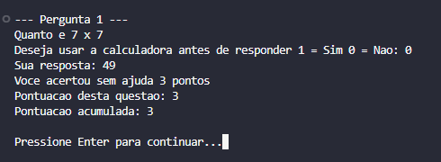

# Quiz Matemático 🧮🎮

Um jogo de perguntas e respostas de matemática básica em C, com sistema de pontuação, histórico e calculadora integrada.

---

## 📌 Descrição
O **Matematequiz** é um quiz interativo de matemática que apresenta ao jogador 10 perguntas de operações básicas (adição, subtração, multiplicação, divisão e raízes).  
O jogador pode optar por usar uma calculadora integrada antes de responder.  
O sistema contabiliza pontos de acordo com o desempenho e exibe o histórico de respostas ao final.

---

## 🎯 Funcionalidades
- Exibe **10 perguntas de matemática básica**.  
- Permite **uso opcional de uma calculadora** (soma, subtração, multiplicação e divisão).  
- Sistema de **pontuação**:  
  - ✅ 3 pontos: resposta correta sem calculadora.  
  - ✅ 1 ponto: resposta correta com calculadora.  
  - ✅ 1 ponto: resposta correta na segunda tentativa.  
  - ❌ 0 pontos: resposta errada.  
- Histórico das respostas (corretas, corretas na segunda tentativa, erradas).  
- Exibição da pontuação acumulada a cada questão.  
- Limpeza de tela automática para facilitar a jogabilidade.  

---

## 🛠️ Tecnologias Utilizadas
- **Linguagem:** C  

**Bibliotecas:**
- `<stdio.h>` → Entrada e saída padrão.  
- `<stdlib.h>` → Funções utilitárias (ex.: `system`, `strtol`, `strtod`).  
- `<string.h>` → Manipulação de strings.  
- `<limits.h>` → Limites de valores numéricos.  
- `<windows.h>` (apenas no Windows) → Configuração de encoding UTF-8.  

---

## 📖 Estruturas Principais
- **`Pergunta`** → Armazena o enunciado e a resposta correta.  
- **`Fila`** → Estrutura circular para registrar histórico das respostas.  

---

## 🎮 Como Jogar
1. Escolha se deseja iniciar o quiz.  
2. A cada pergunta:  
   - Pode optar por usar a **calculadora**.  
   - Digite sua resposta.  
   - Caso erre, pode **tentar novamente** ou visualizar a resposta correta.  
3. Ao final, será exibido:  
   - Pontuação total (máximo: 30 pontos).  
   - Histórico de desempenho em cada questão.  

---

## 📊 Sistema de Pontuação
- ✅ Acertou sem calculadora → **+3 pontos**  
- ✅ Acertou com calculadora → **+1 ponto**  
- ✅ Acertou na segunda tentativa → **+1 ponto**  
- ❌ Errou → **0 pontos**  

---

## 📌 Exemplo de Execução

